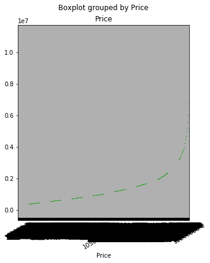

 Melbourne house price data


```python
    import numpy as np
    import pandas as pd
    import os as os
    import seaborn as sns
    from sklearn.preprocessing.imputation import Imputer
    from numpy import mean
    from numpy import std
    
    import matplotlib.pyplot as plt
    %matplotlib inline
    
```

1. To Set the Path 


```python
 cd \Users\ui876630\Desktop\12gb\python\housing\
 
```

    C:\Users\ui876630\Desktop\12gb\python\housing
    

2.To Import the dataset to house dataframe and View the dataset


```python
housedf = pd.read_csv("Melbourne_housing_FULL.csv")
housedf
```


<div>
<style scoped>
    .dataframe tbody tr th:only-of-type {
        vertical-align: middle;
    }

    .dataframe tbody tr th {
        vertical-align: top;
    }

    .dataframe thead th {
        text-align: right;
    }
</style>
<table border="1" class="dataframe">
  <thead>
    <tr style="text-align: right;">
      <th></th>
      <th>Suburb</th>
      <th>Address</th>
      <th>Rooms</th>
      <th>Type</th>
      <th>Price</th>
      <th>Method</th>
      <th>SellerG</th>
      <th>Date</th>
      <th>Distance</th>
      <th>Postcode</th>
      <th>...</th>
      <th>Bathroom</th>
      <th>Car</th>
      <th>Landsize</th>
      <th>BuildingArea</th>
      <th>YearBuilt</th>
      <th>CouncilArea</th>
      <th>Lattitude</th>
      <th>Longtitude</th>
      <th>Regionname</th>
      <th>Propertycount</th>
    </tr>
  </thead>
  <tbody>
    <tr>
      <th>0</th>
      <td>Abbotsford</td>
      <td>68 Studley St</td>
      <td>2</td>
      <td>h</td>
      <td>NaN</td>
      <td>SS</td>
      <td>Jellis</td>
      <td>3/09/2016</td>
      <td>2.5</td>
      <td>3067.0</td>
      <td>...</td>
      <td>1.0</td>
      <td>1.0</td>
      <td>126.0</td>
      <td>NaN</td>
      <td>NaN</td>
      <td>Yarra City Council</td>
      <td>-37.80140</td>
      <td>144.99580</td>
      <td>Northern Metropolitan</td>
      <td>4019.0</td>
    </tr>
    <tr>
      <th>1</th>
      <td>Abbotsford</td>
      <td>85 Turner St</td>
      <td>2</td>
      <td>h</td>
      <td>1480000.0</td>
      <td>S</td>
      <td>Biggin</td>
      <td>3/12/2016</td>
      <td>2.5</td>
      <td>3067.0</td>
      <td>...</td>
      <td>1.0</td>
      <td>1.0</td>
      <td>202.0</td>
      <td>NaN</td>
      <td>NaN</td>
      <td>Yarra City Council</td>
      <td>-37.79960</td>
      <td>144.99840</td>
      <td>Northern Metropolitan</td>
      <td>4019.0</td>
    </tr>
    <tr>
      <th>2</th>
      <td>Abbotsford</td>
      <td>25 Bloomburg St</td>
      <td>2</td>
      <td>h</td>
      <td>1035000.0</td>
      <td>S</td>
      <td>Biggin</td>
      <td>4/02/2016</td>
      <td>2.5</td>
      <td>3067.0</td>
      <td>...</td>
      <td>1.0</td>
      <td>0.0</td>
      <td>156.0</td>
      <td>79.0</td>
      <td>1900.0</td>
      <td>Yarra City Council</td>
      <td>-37.80790</td>
      <td>144.99340</td>
      <td>Northern Metropolitan</td>
      <td>4019.0</td>
    </tr>
    <tr>
      <th>3</th>
      <td>Abbotsford</td>
      <td>18/659 Victoria St</td>
      <td>3</td>
      <td>u</td>
      <td>NaN</td>
      <td>VB</td>
      <td>Rounds</td>
      <td>4/02/2016</td>
      <td>2.5</td>
      <td>3067.0</td>
      <td>...</td>
      <td>2.0</td>
      <td>1.0</td>
      <td>0.0</td>
      <td>NaN</td>
      <td>NaN</td>
      <td>Yarra City Council</td>
      <td>-37.81140</td>
      <td>145.01160</td>
      <td>Northern Metropolitan</td>
      <td>4019.0</td>
    </tr>
    <tr>
      <th>4</th>
      <td>Abbotsford</td>
      <td>5 Charles St</td>
      <td>3</td>
      <td>h</td>
      <td>1465000.0</td>
      <td>SP</td>
      <td>Biggin</td>
      <td>4/03/2017</td>
      <td>2.5</td>
      <td>3067.0</td>
      <td>...</td>
      <td>2.0</td>
      <td>0.0</td>
      <td>134.0</td>
      <td>150.0</td>
      <td>1900.0</td>
      <td>Yarra City Council</td>
      <td>-37.80930</td>
      <td>144.99440</td>
      <td>Northern Metropolitan</td>
      <td>4019.0</td>
    </tr>
    <tr>
      <th>5</th>
      <td>Abbotsford</td>
      <td>40 Federation La</td>
      <td>3</td>
      <td>h</td>
      <td>850000.0</td>
      <td>PI</td>
      <td>Biggin</td>
      <td>4/03/2017</td>
      <td>2.5</td>
      <td>3067.0</td>
      <td>...</td>
      <td>2.0</td>
      <td>1.0</td>
      <td>94.0</td>
      <td>NaN</td>
      <td>NaN</td>
      <td>Yarra City Council</td>
      <td>-37.79690</td>
      <td>144.99690</td>
      <td>Northern Metropolitan</td>
      <td>4019.0</td>
    </tr>
    <tr>
      <th>6</th>
      <td>Abbotsford</td>
      <td>55a Park St</td>
      <td>4</td>
      <td>h</td>
      <td>1600000.0</td>
      <td>VB</td>
      <td>Nelson</td>
      <td>4/06/2016</td>
      <td>2.5</td>
      <td>3067.0</td>
      <td>...</td>
      <td>1.0</td>
      <td>2.0</td>
      <td>120.0</td>
      <td>142.0</td>
      <td>2014.0</td>
      <td>Yarra City Council</td>
      <td>-37.80720</td>
      <td>144.99410</td>
      <td>Northern Metropolitan</td>
      <td>4019.0</td>
    </tr>
    <tr>
      <th>7</th>
      <td>Abbotsford</td>
      <td>16 Maugie St</td>
      <td>4</td>
      <td>h</td>
      <td>NaN</td>
      <td>SN</td>
      <td>Nelson</td>
      <td>6/08/2016</td>
      <td>2.5</td>
      <td>3067.0</td>
      <td>...</td>
      <td>2.0</td>
      <td>2.0</td>
      <td>400.0</td>
      <td>220.0</td>
      <td>2006.0</td>
      <td>Yarra City Council</td>
      <td>-37.79650</td>
      <td>144.99650</td>
      <td>Northern Metropolitan</td>
      <td>4019.0</td>
    </tr>
    <tr>
      <th>8</th>
      <td>Abbotsford</td>
      <td>53 Turner St</td>
      <td>2</td>
      <td>h</td>
      <td>NaN</td>
      <td>S</td>
      <td>Biggin</td>
      <td>6/08/2016</td>
      <td>2.5</td>
      <td>3067.0</td>
      <td>...</td>
      <td>1.0</td>
      <td>2.0</td>
      <td>201.0</td>
      <td>NaN</td>
      <td>1900.0</td>
      <td>Yarra City Council</td>
      <td>-37.79950</td>
      <td>144.99740</td>
      <td>Northern Metropolitan</td>
      <td>4019.0</td>
    </tr>
    <tr>
      <th>9</th>
      <td>Abbotsford</td>
      <td>99 Turner St</td>
      <td>2</td>
      <td>h</td>
      <td>NaN</td>
      <td>S</td>
      <td>Collins</td>
      <td>6/08/2016</td>
      <td>2.5</td>
      <td>3067.0</td>
      <td>...</td>
      <td>2.0</td>
      <td>1.0</td>
      <td>202.0</td>
      <td>NaN</td>
      <td>1900.0</td>
      <td>Yarra City Council</td>
      <td>-37.79960</td>
      <td>144.99890</td>
      <td>Northern Metropolitan</td>
      <td>4019.0</td>
    </tr>
    <tr>
      <th>10</th>
      <td>Abbotsford</td>
      <td>129 Charles St</td>
      <td>2</td>
      <td>h</td>
      <td>941000.0</td>
      <td>S</td>
      <td>Jellis</td>
      <td>7/05/2016</td>
      <td>2.5</td>
      <td>3067.0</td>
      <td>...</td>
      <td>1.0</td>
      <td>0.0</td>
      <td>181.0</td>
      <td>NaN</td>
      <td>NaN</td>
      <td>Yarra City Council</td>
      <td>-37.80410</td>
      <td>144.99530</td>
      <td>Northern Metropolitan</td>
      <td>4019.0</td>
    </tr>
    <tr>
      <th>11</th>
      <td>Abbotsford</td>
      <td>124 Yarra St</td>
      <td>3</td>
      <td>h</td>
      <td>1876000.0</td>
      <td>S</td>
      <td>Nelson</td>
      <td>7/05/2016</td>
      <td>2.5</td>
      <td>3067.0</td>
      <td>...</td>
      <td>2.0</td>
      <td>0.0</td>
      <td>245.0</td>
      <td>210.0</td>
      <td>1910.0</td>
      <td>Yarra City Council</td>
      <td>-37.80240</td>
      <td>144.99930</td>
      <td>Northern Metropolitan</td>
      <td>4019.0</td>
    </tr>
    <tr>
      <th>12</th>
      <td>Abbotsford</td>
      <td>121/56 Nicholson St</td>
      <td>2</td>
      <td>u</td>
      <td>NaN</td>
      <td>PI</td>
      <td>Biggin</td>
      <td>7/11/2016</td>
      <td>2.5</td>
      <td>3067.0</td>
      <td>...</td>
      <td>2.0</td>
      <td>1.0</td>
      <td>4292.0</td>
      <td>82.0</td>
      <td>2009.0</td>
      <td>Yarra City Council</td>
      <td>-37.80780</td>
      <td>144.99650</td>
      <td>Northern Metropolitan</td>
      <td>4019.0</td>
    </tr>
    <tr>
      <th>13</th>
      <td>Abbotsford</td>
      <td>17 Raphael St</td>
      <td>4</td>
      <td>h</td>
      <td>NaN</td>
      <td>W</td>
      <td>Biggin</td>
      <td>7/11/2016</td>
      <td>2.5</td>
      <td>3067.0</td>
      <td>...</td>
      <td>2.0</td>
      <td>0.0</td>
      <td>230.0</td>
      <td>147.0</td>
      <td>1860.0</td>
      <td>Yarra City Council</td>
      <td>-37.80660</td>
      <td>144.99360</td>
      <td>Northern Metropolitan</td>
      <td>4019.0</td>
    </tr>
    <tr>
      <th>14</th>
      <td>Abbotsford</td>
      <td>98 Charles St</td>
      <td>2</td>
      <td>h</td>
      <td>1636000.0</td>
      <td>S</td>
      <td>Nelson</td>
      <td>8/10/2016</td>
      <td>2.5</td>
      <td>3067.0</td>
      <td>...</td>
      <td>1.0</td>
      <td>2.0</td>
      <td>256.0</td>
      <td>107.0</td>
      <td>1890.0</td>
      <td>Yarra City Council</td>
      <td>-37.80600</td>
      <td>144.99540</td>
      <td>Northern Metropolitan</td>
      <td>4019.0</td>
    </tr>
    <tr>
      <th>15</th>
      <td>Abbotsford</td>
      <td>217 Langridge St</td>
      <td>3</td>
      <td>h</td>
      <td>1000000.0</td>
      <td>S</td>
      <td>Jellis</td>
      <td>8/10/2016</td>
      <td>2.5</td>
      <td>3067.0</td>
      <td>...</td>
      <td>NaN</td>
      <td>NaN</td>
      <td>NaN</td>
      <td>NaN</td>
      <td>NaN</td>
      <td>Yarra City Council</td>
      <td>NaN</td>
      <td>NaN</td>
      <td>Northern Metropolitan</td>
      <td>4019.0</td>
    </tr>
    <tr>
      <th>16</th>
      <td>Abbotsford</td>
      <td>18a Mollison St</td>
      <td>2</td>
      <td>t</td>
      <td>745000.0</td>
      <td>S</td>
      <td>Jellis</td>
      <td>8/10/2016</td>
      <td>2.5</td>
      <td>3067.0</td>
      <td>...</td>
      <td>NaN</td>
      <td>NaN</td>
      <td>NaN</td>
      <td>NaN</td>
      <td>NaN</td>
      <td>Yarra City Council</td>
      <td>NaN</td>
      <td>NaN</td>
      <td>Northern Metropolitan</td>
      <td>4019.0</td>
    </tr>
    <tr>
      <th>17</th>
      <td>Abbotsford</td>
      <td>6/241 Nicholson St</td>
      <td>1</td>
      <td>u</td>
      <td>300000.0</td>
      <td>S</td>
      <td>Biggin</td>
      <td>8/10/2016</td>
      <td>2.5</td>
      <td>3067.0</td>
      <td>...</td>
      <td>1.0</td>
      <td>1.0</td>
      <td>0.0</td>
      <td>NaN</td>
      <td>NaN</td>
      <td>Yarra City Council</td>
      <td>-37.80080</td>
      <td>144.99730</td>
      <td>Northern Metropolitan</td>
      <td>4019.0</td>
    </tr>
    <tr>
      <th>18</th>
      <td>Abbotsford</td>
      <td>10 Valiant St</td>
      <td>2</td>
      <td>h</td>
      <td>1097000.0</td>
      <td>S</td>
      <td>Biggin</td>
      <td>8/10/2016</td>
      <td>2.5</td>
      <td>3067.0</td>
      <td>...</td>
      <td>1.0</td>
      <td>2.0</td>
      <td>220.0</td>
      <td>75.0</td>
      <td>1900.0</td>
      <td>Yarra City Council</td>
      <td>-37.80100</td>
      <td>144.99890</td>
      <td>Northern Metropolitan</td>
      <td>4019.0</td>
    </tr>
    <tr>
      <th>19</th>
      <td>Abbotsford</td>
      <td>403/609 Victoria St</td>
      <td>2</td>
      <td>u</td>
      <td>542000.0</td>
      <td>S</td>
      <td>Dingle</td>
      <td>8/10/2016</td>
      <td>2.5</td>
      <td>3067.0</td>
      <td>...</td>
      <td>NaN</td>
      <td>NaN</td>
      <td>NaN</td>
      <td>NaN</td>
      <td>NaN</td>
      <td>Yarra City Council</td>
      <td>NaN</td>
      <td>NaN</td>
      <td>Northern Metropolitan</td>
      <td>4019.0</td>
    </tr>
    <tr>
      <th>20</th>
      <td>Abbotsford</td>
      <td>2 Rich St</td>
      <td>2</td>
      <td>h</td>
      <td>NaN</td>
      <td>SP</td>
      <td>Biggin</td>
      <td>10/12/2016</td>
      <td>2.5</td>
      <td>3067.0</td>
      <td>...</td>
      <td>1.0</td>
      <td>1.0</td>
      <td>176.0</td>
      <td>80.0</td>
      <td>1925.0</td>
      <td>Yarra City Council</td>
      <td>-37.79980</td>
      <td>144.99720</td>
      <td>Northern Metropolitan</td>
      <td>4019.0</td>
    </tr>
    <tr>
      <th>21</th>
      <td>Abbotsford</td>
      <td>25/84 Trenerry Cr</td>
      <td>2</td>
      <td>u</td>
      <td>760000.0</td>
      <td>SP</td>
      <td>Biggin</td>
      <td>10/12/2016</td>
      <td>2.5</td>
      <td>3067.0</td>
      <td>...</td>
      <td>NaN</td>
      <td>NaN</td>
      <td>NaN</td>
      <td>NaN</td>
      <td>NaN</td>
      <td>Yarra City Council</td>
      <td>NaN</td>
      <td>NaN</td>
      <td>Northern Metropolitan</td>
      <td>4019.0</td>
    </tr>
    <tr>
      <th>22</th>
      <td>Abbotsford</td>
      <td>106/119 Turner St</td>
      <td>1</td>
      <td>u</td>
      <td>481000.0</td>
      <td>SP</td>
      <td>Purplebricks</td>
      <td>10/12/2016</td>
      <td>2.5</td>
      <td>3067.0</td>
      <td>...</td>
      <td>NaN</td>
      <td>NaN</td>
      <td>NaN</td>
      <td>NaN</td>
      <td>NaN</td>
      <td>Yarra City Council</td>
      <td>NaN</td>
      <td>NaN</td>
      <td>Northern Metropolitan</td>
      <td>4019.0</td>
    </tr>
    <tr>
      <th>23</th>
      <td>Abbotsford</td>
      <td>411/8 Grosvenor St</td>
      <td>2</td>
      <td>u</td>
      <td>700000.0</td>
      <td>VB</td>
      <td>Jellis</td>
      <td>12/11/2016</td>
      <td>2.5</td>
      <td>3067.0</td>
      <td>...</td>
      <td>2.0</td>
      <td>1.0</td>
      <td>0.0</td>
      <td>NaN</td>
      <td>NaN</td>
      <td>Yarra City Council</td>
      <td>-37.81100</td>
      <td>145.00670</td>
      <td>Northern Metropolitan</td>
      <td>4019.0</td>
    </tr>
    <tr>
      <th>24</th>
      <td>Abbotsford</td>
      <td>40 Nicholson St</td>
      <td>3</td>
      <td>h</td>
      <td>1350000.0</td>
      <td>VB</td>
      <td>Nelson</td>
      <td>12/11/2016</td>
      <td>2.5</td>
      <td>3067.0</td>
      <td>...</td>
      <td>2.0</td>
      <td>2.0</td>
      <td>214.0</td>
      <td>190.0</td>
      <td>2005.0</td>
      <td>Yarra City Council</td>
      <td>-37.80850</td>
      <td>144.99640</td>
      <td>Northern Metropolitan</td>
      <td>4019.0</td>
    </tr>
    <tr>
      <th>25</th>
      <td>Abbotsford</td>
      <td>123/56 Nicholson St</td>
      <td>2</td>
      <td>u</td>
      <td>750000.0</td>
      <td>S</td>
      <td>Biggin</td>
      <td>12/11/2016</td>
      <td>2.5</td>
      <td>3067.0</td>
      <td>...</td>
      <td>2.0</td>
      <td>1.0</td>
      <td>0.0</td>
      <td>94.0</td>
      <td>2009.0</td>
      <td>Yarra City Council</td>
      <td>-37.80780</td>
      <td>144.99650</td>
      <td>Northern Metropolitan</td>
      <td>4019.0</td>
    </tr>
    <tr>
      <th>26</th>
      <td>Abbotsford</td>
      <td>22 Park St</td>
      <td>4</td>
      <td>h</td>
      <td>1985000.0</td>
      <td>S</td>
      <td>Biggin</td>
      <td>12/11/2016</td>
      <td>2.5</td>
      <td>3067.0</td>
      <td>...</td>
      <td>NaN</td>
      <td>NaN</td>
      <td>NaN</td>
      <td>NaN</td>
      <td>NaN</td>
      <td>Yarra City Council</td>
      <td>-37.80840</td>
      <td>144.99420</td>
      <td>Northern Metropolitan</td>
      <td>4019.0</td>
    </tr>
    <tr>
      <th>27</th>
      <td>Abbotsford</td>
      <td>13/84 Trenerry Cr</td>
      <td>1</td>
      <td>u</td>
      <td>500000.0</td>
      <td>S</td>
      <td>Biggin</td>
      <td>12/11/2016</td>
      <td>2.5</td>
      <td>3067.0</td>
      <td>...</td>
      <td>NaN</td>
      <td>NaN</td>
      <td>NaN</td>
      <td>NaN</td>
      <td>NaN</td>
      <td>Yarra City Council</td>
      <td>NaN</td>
      <td>NaN</td>
      <td>Northern Metropolitan</td>
      <td>4019.0</td>
    </tr>
    <tr>
      <th>28</th>
      <td>Abbotsford</td>
      <td>45 William St</td>
      <td>2</td>
      <td>h</td>
      <td>1172500.0</td>
      <td>S</td>
      <td>Biggin</td>
      <td>13/08/2016</td>
      <td>2.5</td>
      <td>3067.0</td>
      <td>...</td>
      <td>1.0</td>
      <td>1.0</td>
      <td>195.0</td>
      <td>NaN</td>
      <td>NaN</td>
      <td>Yarra City Council</td>
      <td>-37.80840</td>
      <td>144.99730</td>
      <td>Northern Metropolitan</td>
      <td>4019.0</td>
    </tr>
    <tr>
      <th>29</th>
      <td>Abbotsford</td>
      <td>7/20 Abbotsford St</td>
      <td>1</td>
      <td>u</td>
      <td>441000.0</td>
      <td>SP</td>
      <td>Greg</td>
      <td>14/05/2016</td>
      <td>2.5</td>
      <td>3067.0</td>
      <td>...</td>
      <td>1.0</td>
      <td>1.0</td>
      <td>0.0</td>
      <td>NaN</td>
      <td>NaN</td>
      <td>Yarra City Council</td>
      <td>-37.80160</td>
      <td>144.99880</td>
      <td>Northern Metropolitan</td>
      <td>4019.0</td>
    </tr>
    <tr>
      <th>...</th>
      <td>...</td>
      <td>...</td>
      <td>...</td>
      <td>...</td>
      <td>...</td>
      <td>...</td>
      <td>...</td>
      <td>...</td>
      <td>...</td>
      <td>...</td>
      <td>...</td>
      <td>...</td>
      <td>...</td>
      <td>...</td>
      <td>...</td>
      <td>...</td>
      <td>...</td>
      <td>...</td>
      <td>...</td>
      <td>...</td>
      <td>...</td>
    </tr>
    <tr>
      <th>34827</th>
      <td>West Footscray</td>
      <td>13 Barton St</td>
      <td>4</td>
      <td>h</td>
      <td>1096000.0</td>
      <td>S</td>
      <td>Jas</td>
      <td>24/02/2018</td>
      <td>6.4</td>
      <td>3012.0</td>
      <td>...</td>
      <td>1.0</td>
      <td>3.0</td>
      <td>368.0</td>
      <td>NaN</td>
      <td>NaN</td>
      <td>Maribyrnong City Council</td>
      <td>-37.79152</td>
      <td>144.87277</td>
      <td>Western Metropolitan</td>
      <td>5058.0</td>
    </tr>
    <tr>
      <th>34828</th>
      <td>West Footscray</td>
      <td>30 Gwelo St</td>
      <td>3</td>
      <td>h</td>
      <td>900000.0</td>
      <td>PI</td>
      <td>Village</td>
      <td>24/02/2018</td>
      <td>6.4</td>
      <td>3012.0</td>
      <td>...</td>
      <td>1.0</td>
      <td>2.0</td>
      <td>460.0</td>
      <td>112.0</td>
      <td>1940.0</td>
      <td>Maribyrnong City Council</td>
      <td>-37.80139</td>
      <td>144.86458</td>
      <td>Western Metropolitan</td>
      <td>5058.0</td>
    </tr>
    <tr>
      <th>34829</th>
      <td>West Melbourne</td>
      <td>9/11 Anderson St</td>
      <td>3</td>
      <td>u</td>
      <td>NaN</td>
      <td>S</td>
      <td>hockingstuart</td>
      <td>24/02/2018</td>
      <td>3.1</td>
      <td>3003.0</td>
      <td>...</td>
      <td>NaN</td>
      <td>NaN</td>
      <td>NaN</td>
      <td>NaN</td>
      <td>NaN</td>
      <td>Melbourne City Council</td>
      <td>NaN</td>
      <td>NaN</td>
      <td>Northern Metropolitan</td>
      <td>2230.0</td>
    </tr>
    <tr>
      <th>34830</th>
      <td>West Melbourne</td>
      <td>122 Railway Pl</td>
      <td>3</td>
      <td>t</td>
      <td>1150000.0</td>
      <td>S</td>
      <td>Jellis</td>
      <td>24/02/2018</td>
      <td>3.1</td>
      <td>3003.0</td>
      <td>...</td>
      <td>2.0</td>
      <td>2.0</td>
      <td>678.0</td>
      <td>NaN</td>
      <td>NaN</td>
      <td>Melbourne City Council</td>
      <td>-37.80787</td>
      <td>144.94334</td>
      <td>Northern Metropolitan</td>
      <td>2230.0</td>
    </tr>
    <tr>
      <th>34831</th>
      <td>Westmeadows</td>
      <td>35 Arnside Cr</td>
      <td>4</td>
      <td>h</td>
      <td>675000.0</td>
      <td>S</td>
      <td>YPA</td>
      <td>24/02/2018</td>
      <td>16.5</td>
      <td>3049.0</td>
      <td>...</td>
      <td>2.0</td>
      <td>5.0</td>
      <td>560.0</td>
      <td>148.0</td>
      <td>1980.0</td>
      <td>Hume City Council</td>
      <td>-37.68089</td>
      <td>144.87403</td>
      <td>Northern Metropolitan</td>
      <td>2474.0</td>
    </tr>
    <tr>
      <th>34832</th>
      <td>Westmeadows</td>
      <td>2/8 Forman St</td>
      <td>4</td>
      <td>u</td>
      <td>689000.0</td>
      <td>S</td>
      <td>YPA</td>
      <td>24/02/2018</td>
      <td>16.5</td>
      <td>3049.0</td>
      <td>...</td>
      <td>NaN</td>
      <td>NaN</td>
      <td>NaN</td>
      <td>NaN</td>
      <td>NaN</td>
      <td>Hume City Council</td>
      <td>NaN</td>
      <td>NaN</td>
      <td>Northern Metropolitan</td>
      <td>2474.0</td>
    </tr>
    <tr>
      <th>34833</th>
      <td>Wheelers Hill</td>
      <td>45 Chancellor Dr</td>
      <td>4</td>
      <td>h</td>
      <td>936000.0</td>
      <td>S</td>
      <td>Barry</td>
      <td>24/02/2018</td>
      <td>16.7</td>
      <td>3150.0</td>
      <td>...</td>
      <td>2.0</td>
      <td>2.0</td>
      <td>770.0</td>
      <td>NaN</td>
      <td>NaN</td>
      <td>Monash City Council</td>
      <td>-37.91637</td>
      <td>145.18062</td>
      <td>South-Eastern Metropolitan</td>
      <td>7392.0</td>
    </tr>
    <tr>
      <th>34834</th>
      <td>Wheelers Hill</td>
      <td>112 Jells Rd</td>
      <td>4</td>
      <td>h</td>
      <td>NaN</td>
      <td>PN</td>
      <td>Harcourts</td>
      <td>24/02/2018</td>
      <td>16.7</td>
      <td>3150.0</td>
      <td>...</td>
      <td>2.0</td>
      <td>2.0</td>
      <td>714.0</td>
      <td>NaN</td>
      <td>NaN</td>
      <td>Monash City Council</td>
      <td>-37.90287</td>
      <td>145.19011</td>
      <td>South-Eastern Metropolitan</td>
      <td>7392.0</td>
    </tr>
    <tr>
      <th>34835</th>
      <td>Wheelers Hill</td>
      <td>20 Mill Ct</td>
      <td>3</td>
      <td>h</td>
      <td>NaN</td>
      <td>S</td>
      <td>Barry</td>
      <td>24/02/2018</td>
      <td>16.7</td>
      <td>3150.0</td>
      <td>...</td>
      <td>2.0</td>
      <td>2.0</td>
      <td>677.0</td>
      <td>NaN</td>
      <td>NaN</td>
      <td>Monash City Council</td>
      <td>-37.91905</td>
      <td>145.19105</td>
      <td>South-Eastern Metropolitan</td>
      <td>7392.0</td>
    </tr>
    <tr>
      <th>34836</th>
      <td>Wheelers Hill</td>
      <td>9 Walden Av</td>
      <td>5</td>
      <td>h</td>
      <td>1400000.0</td>
      <td>S</td>
      <td>LLC</td>
      <td>24/02/2018</td>
      <td>16.7</td>
      <td>3150.0</td>
      <td>...</td>
      <td>2.0</td>
      <td>2.0</td>
      <td>739.0</td>
      <td>293.0</td>
      <td>1980.0</td>
      <td>Monash City Council</td>
      <td>-37.89304</td>
      <td>145.18475</td>
      <td>South-Eastern Metropolitan</td>
      <td>7392.0</td>
    </tr>
    <tr>
      <th>34837</th>
      <td>Williamstown</td>
      <td>13 Kingshott Cl</td>
      <td>5</td>
      <td>h</td>
      <td>2020000.0</td>
      <td>S</td>
      <td>Greg</td>
      <td>24/02/2018</td>
      <td>6.8</td>
      <td>3016.0</td>
      <td>...</td>
      <td>3.0</td>
      <td>2.0</td>
      <td>450.0</td>
      <td>241.0</td>
      <td>2015.0</td>
      <td>Hobsons Bay City Council</td>
      <td>-37.86180</td>
      <td>144.87855</td>
      <td>Western Metropolitan</td>
      <td>6380.0</td>
    </tr>
    <tr>
      <th>34838</th>
      <td>Williamstown</td>
      <td>11/81 Melbourne Rd</td>
      <td>2</td>
      <td>u</td>
      <td>450000.0</td>
      <td>SP</td>
      <td>Raine</td>
      <td>24/02/2018</td>
      <td>6.8</td>
      <td>3016.0</td>
      <td>...</td>
      <td>NaN</td>
      <td>NaN</td>
      <td>NaN</td>
      <td>NaN</td>
      <td>NaN</td>
      <td>Hobsons Bay City Council</td>
      <td>NaN</td>
      <td>NaN</td>
      <td>Western Metropolitan</td>
      <td>6380.0</td>
    </tr>
    <tr>
      <th>34839</th>
      <td>Williamstown</td>
      <td>24/18 Station Rd</td>
      <td>2</td>
      <td>u</td>
      <td>475000.0</td>
      <td>SP</td>
      <td>Greg</td>
      <td>24/02/2018</td>
      <td>6.8</td>
      <td>3016.0</td>
      <td>...</td>
      <td>NaN</td>
      <td>NaN</td>
      <td>NaN</td>
      <td>NaN</td>
      <td>NaN</td>
      <td>Hobsons Bay City Council</td>
      <td>NaN</td>
      <td>NaN</td>
      <td>Western Metropolitan</td>
      <td>6380.0</td>
    </tr>
    <tr>
      <th>34840</th>
      <td>Williamstown</td>
      <td>3/2 Thompson St</td>
      <td>2</td>
      <td>u</td>
      <td>520000.0</td>
      <td>VB</td>
      <td>Raine</td>
      <td>24/02/2018</td>
      <td>6.8</td>
      <td>3016.0</td>
      <td>...</td>
      <td>NaN</td>
      <td>NaN</td>
      <td>NaN</td>
      <td>NaN</td>
      <td>NaN</td>
      <td>Hobsons Bay City Council</td>
      <td>NaN</td>
      <td>NaN</td>
      <td>Western Metropolitan</td>
      <td>6380.0</td>
    </tr>
    <tr>
      <th>34841</th>
      <td>Williamstown</td>
      <td>5 Thompson St</td>
      <td>2</td>
      <td>h</td>
      <td>940000.0</td>
      <td>VB</td>
      <td>Williams</td>
      <td>24/02/2018</td>
      <td>6.8</td>
      <td>3016.0</td>
      <td>...</td>
      <td>2.0</td>
      <td>1.0</td>
      <td>122.0</td>
      <td>NaN</td>
      <td>1999.0</td>
      <td>Hobsons Bay City Council</td>
      <td>-37.86396</td>
      <td>144.90541</td>
      <td>Western Metropolitan</td>
      <td>6380.0</td>
    </tr>
    <tr>
      <th>34842</th>
      <td>Williamstown</td>
      <td>34 Twyford St</td>
      <td>3</td>
      <td>h</td>
      <td>1400000.0</td>
      <td>SP</td>
      <td>Sweeney</td>
      <td>24/02/2018</td>
      <td>6.8</td>
      <td>3016.0</td>
      <td>...</td>
      <td>2.0</td>
      <td>NaN</td>
      <td>325.0</td>
      <td>158.0</td>
      <td>1995.0</td>
      <td>Hobsons Bay City Council</td>
      <td>-37.86871</td>
      <td>144.90124</td>
      <td>Western Metropolitan</td>
      <td>6380.0</td>
    </tr>
    <tr>
      <th>34843</th>
      <td>Williamstown North</td>
      <td>32 Edina St</td>
      <td>3</td>
      <td>h</td>
      <td>830000.0</td>
      <td>S</td>
      <td>hockingstuart</td>
      <td>24/02/2018</td>
      <td>6.8</td>
      <td>3016.0</td>
      <td>...</td>
      <td>1.0</td>
      <td>2.0</td>
      <td>345.0</td>
      <td>NaN</td>
      <td>1949.0</td>
      <td>Hobsons Bay City Council</td>
      <td>-37.85545</td>
      <td>144.88118</td>
      <td>Western Metropolitan</td>
      <td>802.0</td>
    </tr>
    <tr>
      <th>34844</th>
      <td>Windsor</td>
      <td>4/16 Lewisham Rd</td>
      <td>1</td>
      <td>u</td>
      <td>440000.0</td>
      <td>SP</td>
      <td>Biggin</td>
      <td>24/02/2018</td>
      <td>4.6</td>
      <td>3181.0</td>
      <td>...</td>
      <td>NaN</td>
      <td>NaN</td>
      <td>NaN</td>
      <td>NaN</td>
      <td>NaN</td>
      <td>Port Phillip City Council</td>
      <td>NaN</td>
      <td>NaN</td>
      <td>Southern Metropolitan</td>
      <td>4380.0</td>
    </tr>
    <tr>
      <th>34845</th>
      <td>Windsor</td>
      <td>13 Mary St</td>
      <td>4</td>
      <td>h</td>
      <td>NaN</td>
      <td>W</td>
      <td>Jellis</td>
      <td>24/02/2018</td>
      <td>4.6</td>
      <td>3181.0</td>
      <td>...</td>
      <td>3.0</td>
      <td>2.0</td>
      <td>279.0</td>
      <td>237.0</td>
      <td>2009.0</td>
      <td>Port Phillip City Council</td>
      <td>-37.85418</td>
      <td>144.99697</td>
      <td>Southern Metropolitan</td>
      <td>4380.0</td>
    </tr>
    <tr>
      <th>34846</th>
      <td>Wollert</td>
      <td>10 Alma Rd</td>
      <td>4</td>
      <td>h</td>
      <td>630000.0</td>
      <td>SP</td>
      <td>hockingstuart</td>
      <td>24/02/2018</td>
      <td>25.5</td>
      <td>3750.0</td>
      <td>...</td>
      <td>2.0</td>
      <td>2.0</td>
      <td>388.0</td>
      <td>NaN</td>
      <td>NaN</td>
      <td>Whittlesea City Council</td>
      <td>-37.60981</td>
      <td>145.04135</td>
      <td>Northern Metropolitan</td>
      <td>2940.0</td>
    </tr>
    <tr>
      <th>34847</th>
      <td>Wollert</td>
      <td>27 Birchmore Rd</td>
      <td>3</td>
      <td>h</td>
      <td>500000.0</td>
      <td>PI</td>
      <td>Ray</td>
      <td>24/02/2018</td>
      <td>25.5</td>
      <td>3750.0</td>
      <td>...</td>
      <td>2.0</td>
      <td>2.0</td>
      <td>383.0</td>
      <td>118.0</td>
      <td>2016.0</td>
      <td>Whittlesea City Council</td>
      <td>-37.61940</td>
      <td>145.03951</td>
      <td>Northern Metropolitan</td>
      <td>2940.0</td>
    </tr>
    <tr>
      <th>34848</th>
      <td>Wollert</td>
      <td>16 Gunther Wy</td>
      <td>4</td>
      <td>h</td>
      <td>621000.0</td>
      <td>S</td>
      <td>hockingstuart</td>
      <td>24/02/2018</td>
      <td>25.5</td>
      <td>3750.0</td>
      <td>...</td>
      <td>2.0</td>
      <td>2.0</td>
      <td>375.0</td>
      <td>NaN</td>
      <td>NaN</td>
      <td>Whittlesea City Council</td>
      <td>-37.61331</td>
      <td>145.03412</td>
      <td>Northern Metropolitan</td>
      <td>2940.0</td>
    </tr>
    <tr>
      <th>34849</th>
      <td>Wollert</td>
      <td>35 Kingscote Wy</td>
      <td>3</td>
      <td>h</td>
      <td>570000.0</td>
      <td>SP</td>
      <td>RW</td>
      <td>24/02/2018</td>
      <td>25.5</td>
      <td>3750.0</td>
      <td>...</td>
      <td>2.0</td>
      <td>2.0</td>
      <td>404.0</td>
      <td>158.0</td>
      <td>2012.0</td>
      <td>Whittlesea City Council</td>
      <td>-37.61031</td>
      <td>145.03393</td>
      <td>Northern Metropolitan</td>
      <td>2940.0</td>
    </tr>
    <tr>
      <th>34850</th>
      <td>Wollert</td>
      <td>15 Rockgarden Wy</td>
      <td>3</td>
      <td>h</td>
      <td>NaN</td>
      <td>SP</td>
      <td>LJ</td>
      <td>24/02/2018</td>
      <td>25.5</td>
      <td>3750.0</td>
      <td>...</td>
      <td>2.0</td>
      <td>2.0</td>
      <td>268.0</td>
      <td>135.0</td>
      <td>2016.0</td>
      <td>Whittlesea City Council</td>
      <td>-37.61094</td>
      <td>145.04281</td>
      <td>Northern Metropolitan</td>
      <td>2940.0</td>
    </tr>
    <tr>
      <th>34851</th>
      <td>Yarraville</td>
      <td>78 Bayview Rd</td>
      <td>3</td>
      <td>h</td>
      <td>1101000.0</td>
      <td>S</td>
      <td>Jas</td>
      <td>24/02/2018</td>
      <td>6.3</td>
      <td>3013.0</td>
      <td>...</td>
      <td>1.0</td>
      <td>NaN</td>
      <td>288.0</td>
      <td>NaN</td>
      <td>NaN</td>
      <td>Maribyrnong City Council</td>
      <td>-37.81095</td>
      <td>144.88516</td>
      <td>Western Metropolitan</td>
      <td>6543.0</td>
    </tr>
    <tr>
      <th>34852</th>
      <td>Yarraville</td>
      <td>13 Burns St</td>
      <td>4</td>
      <td>h</td>
      <td>1480000.0</td>
      <td>PI</td>
      <td>Jas</td>
      <td>24/02/2018</td>
      <td>6.3</td>
      <td>3013.0</td>
      <td>...</td>
      <td>1.0</td>
      <td>3.0</td>
      <td>593.0</td>
      <td>NaN</td>
      <td>NaN</td>
      <td>Maribyrnong City Council</td>
      <td>-37.81053</td>
      <td>144.88467</td>
      <td>Western Metropolitan</td>
      <td>6543.0</td>
    </tr>
    <tr>
      <th>34853</th>
      <td>Yarraville</td>
      <td>29A Murray St</td>
      <td>2</td>
      <td>h</td>
      <td>888000.0</td>
      <td>SP</td>
      <td>Sweeney</td>
      <td>24/02/2018</td>
      <td>6.3</td>
      <td>3013.0</td>
      <td>...</td>
      <td>2.0</td>
      <td>1.0</td>
      <td>98.0</td>
      <td>104.0</td>
      <td>2018.0</td>
      <td>Maribyrnong City Council</td>
      <td>-37.81551</td>
      <td>144.88826</td>
      <td>Western Metropolitan</td>
      <td>6543.0</td>
    </tr>
    <tr>
      <th>34854</th>
      <td>Yarraville</td>
      <td>147A Severn St</td>
      <td>2</td>
      <td>t</td>
      <td>705000.0</td>
      <td>S</td>
      <td>Jas</td>
      <td>24/02/2018</td>
      <td>6.3</td>
      <td>3013.0</td>
      <td>...</td>
      <td>1.0</td>
      <td>2.0</td>
      <td>220.0</td>
      <td>120.0</td>
      <td>2000.0</td>
      <td>Maribyrnong City Council</td>
      <td>-37.82286</td>
      <td>144.87856</td>
      <td>Western Metropolitan</td>
      <td>6543.0</td>
    </tr>
    <tr>
      <th>34855</th>
      <td>Yarraville</td>
      <td>12/37 Stephen St</td>
      <td>3</td>
      <td>h</td>
      <td>1140000.0</td>
      <td>SP</td>
      <td>hockingstuart</td>
      <td>24/02/2018</td>
      <td>6.3</td>
      <td>3013.0</td>
      <td>...</td>
      <td>NaN</td>
      <td>NaN</td>
      <td>NaN</td>
      <td>NaN</td>
      <td>NaN</td>
      <td>Maribyrnong City Council</td>
      <td>NaN</td>
      <td>NaN</td>
      <td>Western Metropolitan</td>
      <td>6543.0</td>
    </tr>
    <tr>
      <th>34856</th>
      <td>Yarraville</td>
      <td>3 Tarrengower St</td>
      <td>2</td>
      <td>h</td>
      <td>1020000.0</td>
      <td>PI</td>
      <td>RW</td>
      <td>24/02/2018</td>
      <td>6.3</td>
      <td>3013.0</td>
      <td>...</td>
      <td>1.0</td>
      <td>0.0</td>
      <td>250.0</td>
      <td>103.0</td>
      <td>1930.0</td>
      <td>Maribyrnong City Council</td>
      <td>-37.81810</td>
      <td>144.89351</td>
      <td>Western Metropolitan</td>
      <td>6543.0</td>
    </tr>
  </tbody>
</table>
<p>34857 rows × 21 columns</p>
</div>


3. To See the structure and Summary of the dataset


```python
housedf.describe()
```


<div>
<style scoped>
    .dataframe tbody tr th:only-of-type {
        vertical-align: middle;
    }

    .dataframe tbody tr th {
        vertical-align: top;
    }

    .dataframe thead th {
        text-align: right;
    }
</style>
<table border="1" class="dataframe">
  <thead>
    <tr style="text-align: right;">
      <th></th>
      <th>Rooms</th>
      <th>Price</th>
      <th>Distance</th>
      <th>Postcode</th>
      <th>Bedroom2</th>
      <th>Bathroom</th>
      <th>Car</th>
      <th>Landsize</th>
      <th>BuildingArea</th>
      <th>YearBuilt</th>
      <th>Lattitude</th>
      <th>Longtitude</th>
      <th>Propertycount</th>
    </tr>
  </thead>
  <tbody>
    <tr>
      <th>count</th>
      <td>34857.000000</td>
      <td>2.724700e+04</td>
      <td>34856.000000</td>
      <td>34856.000000</td>
      <td>26640.000000</td>
      <td>26631.000000</td>
      <td>26129.000000</td>
      <td>23047.000000</td>
      <td>13742.00000</td>
      <td>15551.000000</td>
      <td>26881.000000</td>
      <td>26881.000000</td>
      <td>34854.000000</td>
    </tr>
    <tr>
      <th>mean</th>
      <td>3.031012</td>
      <td>1.050173e+06</td>
      <td>11.184929</td>
      <td>3116.062859</td>
      <td>3.084647</td>
      <td>1.624798</td>
      <td>1.728845</td>
      <td>593.598993</td>
      <td>160.25640</td>
      <td>1965.289885</td>
      <td>-37.810634</td>
      <td>145.001851</td>
      <td>7572.888306</td>
    </tr>
    <tr>
      <th>std</th>
      <td>0.969933</td>
      <td>6.414671e+05</td>
      <td>6.788892</td>
      <td>109.023903</td>
      <td>0.980690</td>
      <td>0.724212</td>
      <td>1.010771</td>
      <td>3398.841946</td>
      <td>401.26706</td>
      <td>37.328178</td>
      <td>0.090279</td>
      <td>0.120169</td>
      <td>4428.090313</td>
    </tr>
    <tr>
      <th>min</th>
      <td>1.000000</td>
      <td>8.500000e+04</td>
      <td>0.000000</td>
      <td>3000.000000</td>
      <td>0.000000</td>
      <td>0.000000</td>
      <td>0.000000</td>
      <td>0.000000</td>
      <td>0.00000</td>
      <td>1196.000000</td>
      <td>-38.190430</td>
      <td>144.423790</td>
      <td>83.000000</td>
    </tr>
    <tr>
      <th>25%</th>
      <td>2.000000</td>
      <td>6.350000e+05</td>
      <td>6.400000</td>
      <td>3051.000000</td>
      <td>2.000000</td>
      <td>1.000000</td>
      <td>1.000000</td>
      <td>224.000000</td>
      <td>102.00000</td>
      <td>1940.000000</td>
      <td>-37.862950</td>
      <td>144.933500</td>
      <td>4385.000000</td>
    </tr>
    <tr>
      <th>50%</th>
      <td>3.000000</td>
      <td>8.700000e+05</td>
      <td>10.300000</td>
      <td>3103.000000</td>
      <td>3.000000</td>
      <td>2.000000</td>
      <td>2.000000</td>
      <td>521.000000</td>
      <td>136.00000</td>
      <td>1970.000000</td>
      <td>-37.807600</td>
      <td>145.007800</td>
      <td>6763.000000</td>
    </tr>
    <tr>
      <th>75%</th>
      <td>4.000000</td>
      <td>1.295000e+06</td>
      <td>14.000000</td>
      <td>3156.000000</td>
      <td>4.000000</td>
      <td>2.000000</td>
      <td>2.000000</td>
      <td>670.000000</td>
      <td>188.00000</td>
      <td>2000.000000</td>
      <td>-37.754100</td>
      <td>145.071900</td>
      <td>10412.000000</td>
    </tr>
    <tr>
      <th>max</th>
      <td>16.000000</td>
      <td>1.120000e+07</td>
      <td>48.100000</td>
      <td>3978.000000</td>
      <td>30.000000</td>
      <td>12.000000</td>
      <td>26.000000</td>
      <td>433014.000000</td>
      <td>44515.00000</td>
      <td>2106.000000</td>
      <td>-37.390200</td>
      <td>145.526350</td>
      <td>21650.000000</td>
    </tr>
  </tbody>
</table>
</div>


4.To find the number of Categorical and Numberical attributes


```python
cc = housedf.select_dtypes(exclude=['int', 'float']).columns
dd = housedf.select_dtypes(include=['int', 'float']).columns
print 'Number of Categorical Columns : ' , len(cc)
print 'Number of Numerical Columns   :'  , len(dd)


```

    Number of Categorical Columns :  9
    Number of Numerical Columns   : 12
    

5. To find the rows present in the dataet


```python
len(housedf)
```


    34857


6. To find the duplicates in the dataset


```python
housedf[housedf.duplicated(keep=False)]
```


<div>
<style scoped>
    .dataframe tbody tr th:only-of-type {
        vertical-align: middle;
    }

    .dataframe tbody tr th {
        vertical-align: top;
    }

    .dataframe thead th {
        text-align: right;
    }
</style>
<table border="1" class="dataframe">
  <thead>
    <tr style="text-align: right;">
      <th></th>
      <th>Suburb</th>
      <th>Address</th>
      <th>Rooms</th>
      <th>Type</th>
      <th>Price</th>
      <th>Method</th>
      <th>SellerG</th>
      <th>Date</th>
      <th>Distance</th>
      <th>Postcode</th>
      <th>...</th>
      <th>Bathroom</th>
      <th>Car</th>
      <th>Landsize</th>
      <th>BuildingArea</th>
      <th>YearBuilt</th>
      <th>CouncilArea</th>
      <th>Lattitude</th>
      <th>Longtitude</th>
      <th>Regionname</th>
      <th>Propertycount</th>
    </tr>
  </thead>
  <tbody>
    <tr>
      <th>15857</th>
      <td>Nunawading</td>
      <td>1/7 Lilian St</td>
      <td>3</td>
      <td>t</td>
      <td>NaN</td>
      <td>SP</td>
      <td>Jellis</td>
      <td>17/06/2017</td>
      <td>15.4</td>
      <td>3131.0</td>
      <td>...</td>
      <td>3.0</td>
      <td>2.0</td>
      <td>405.0</td>
      <td>226.0</td>
      <td>2000.0</td>
      <td>Manningham City Council</td>
      <td>-37.82678</td>
      <td>145.16777</td>
      <td>Eastern Metropolitan</td>
      <td>4973.0</td>
    </tr>
    <tr>
      <th>15858</th>
      <td>Nunawading</td>
      <td>1/7 Lilian St</td>
      <td>3</td>
      <td>t</td>
      <td>NaN</td>
      <td>SP</td>
      <td>Jellis</td>
      <td>17/06/2017</td>
      <td>15.4</td>
      <td>3131.0</td>
      <td>...</td>
      <td>3.0</td>
      <td>2.0</td>
      <td>405.0</td>
      <td>226.0</td>
      <td>2000.0</td>
      <td>Manningham City Council</td>
      <td>-37.82678</td>
      <td>145.16777</td>
      <td>Eastern Metropolitan</td>
      <td>4973.0</td>
    </tr>
  </tbody>
</table>
<p>2 rows × 21 columns</p>
</div>


6 To drop the duplicate rows


```python
housedf.drop_duplicates(subset=None, keep=False, inplace=True)
```

7.To count the rows after removing duplicates


```python
len(housedf)
```


    34855


8. To find the counts of missing values in each columns


```python
housedf.isnull().sum()
```


    Suburb               0
    Address              0
    Rooms                0
    Type                 0
    Price             7608
    Method               0
    SellerG              0
    Date                 0
    Distance             1
    Postcode             1
    Bedroom2          8217
    Bathroom          8226
    Car               8728
    Landsize         11810
    BuildingArea     21115
    YearBuilt        19306
    CouncilArea          3
    Lattitude         7976
    Longtitude        7976
    Regionname           3
    Propertycount        3
    dtype: int64


9. To impute missing values with mean for numerics and most frequent values for Object columns


```python
from sklearn.base import TransformerMixin

class DataFrameImputer(TransformerMixin):

    def __init__(self):
        """Impute missing values.
        """
    def fit(self, X, y=None):

        self.fill = pd.Series([X[c].value_counts().index[0]
            if X[c].dtype == np.dtype('O') else X[c].mean() for c in X],
            index=X.columns)

        return self

    def transform(self, X, y=None):
        return X.fillna(self.fill)
```


```python
imputedf = DataFrameImputer().fit_transform(housedf)
```

10. Check nulls after Impute.No column should have missing values


```python
imputedf.isnull().sum()
```


    Suburb           0
    Address          0
    Rooms            0
    Type             0
    Price            0
    Method           0
    SellerG          0
    Date             0
    Distance         0
    Postcode         0
    Bedroom2         0
    Bathroom         0
    Car              0
    Landsize         0
    BuildingArea     0
    YearBuilt        0
    CouncilArea      0
    Lattitude        0
    Longtitude       0
    Regionname       0
    Propertycount    0
    dtype: int64


11. Check the variable types and then change the variable type based on data dictionary


```python
imputedf.dtypes
```


    Suburb            object
    Address           object
    Rooms              int64
    Type              object
    Price            float64
    Method            object
    SellerG           object
    Date              object
    Distance         float64
    Postcode         float64
    Bedroom2         float64
    Bathroom         float64
    Car              float64
    Landsize         float64
    BuildingArea     float64
    YearBuilt        float64
    CouncilArea       object
    Lattitude        float64
    Longtitude       float64
    Regionname        object
    Propertycount    float64
    dtype: object


```python
imputedf['Date'] = imputedf['Date'].astype('datetime64[ns]')
imputedf['YearBuilt'] = imputedf['YearBuilt'].astype('datetime64[ns]')
imputedf['Car'] = imputedf['Car'].astype('int')
imputedf['Price'] = imputedf['Car'].astype('int64')
imputedf['Price'] = imputedf['Car'].astype('int64')
imputedf['Postcode'] = imputedf['Postcode'].astype('int64')
imputedf['Bedroom2'] = imputedf['Bedroom2'].astype('int')
imputedf['Bathroom'] = imputedf['Bathroom'].astype('int')
imputedf['Landsize'] = imputedf['Landsize'].astype('int')
imputedf['Propertycount'] = imputedf['Propertycount'].astype('int')


```


```python
imputedf.dtypes
```


    Suburb                   object
    Address                  object
    Rooms                     int64
    Type                     object
    Price                     int64
    Method                   object
    SellerG                  object
    Date             datetime64[ns]
    Distance                float64
    Postcode                  int64
    Bedroom2                  int32
    Bathroom                  int32
    Car                       int32
    Landsize                  int32
    BuildingArea            float64
    YearBuilt        datetime64[ns]
    CouncilArea              object
    Lattitude               float64
    Longtitude              float64
    Regionname               object
    Propertycount             int32
    dtype: object


12. Copy numeric columns to a new data frame numbericdf


```python
numericdf = imputedf.select_dtypes(include=[np.number])

```


```python
numericdf.describe()
```


<div>
<style scoped>
    .dataframe tbody tr th:only-of-type {
        vertical-align: middle;
    }

    .dataframe tbody tr th {
        vertical-align: top;
    }

    .dataframe thead th {
        text-align: right;
    }
</style>
<table border="1" class="dataframe">
  <thead>
    <tr style="text-align: right;">
      <th></th>
      <th>Rooms</th>
      <th>Price</th>
      <th>Distance</th>
      <th>Postcode</th>
      <th>Bedroom2</th>
      <th>Bathroom</th>
      <th>Car</th>
      <th>Landsize</th>
      <th>BuildingArea</th>
      <th>Lattitude</th>
      <th>Longtitude</th>
      <th>Propertycount</th>
    </tr>
  </thead>
  <tbody>
    <tr>
      <th>count</th>
      <td>34855.000000</td>
      <td>34855.000000</td>
      <td>34855.000000</td>
      <td>34855.000000</td>
      <td>34855.000000</td>
      <td>34855.000000</td>
      <td>34855.000000</td>
      <td>34855.000000</td>
      <td>34855.000000</td>
      <td>34855.000000</td>
      <td>34855.000000</td>
      <td>34855.000000</td>
    </tr>
    <tr>
      <th>mean</th>
      <td>3.031014</td>
      <td>1.546320</td>
      <td>11.184688</td>
      <td>3116.062000</td>
      <td>3.064697</td>
      <td>1.477263</td>
      <td>1.546320</td>
      <td>593.406857</td>
      <td>160.246831</td>
      <td>-37.810633</td>
      <td>145.001839</td>
      <td>7573.037498</td>
    </tr>
    <tr>
      <th>std</th>
      <td>0.969961</td>
      <td>0.930366</td>
      <td>6.788915</td>
      <td>109.025408</td>
      <td>0.858115</td>
      <td>0.686284</td>
      <td>0.930366</td>
      <td>2763.773060</td>
      <td>251.950670</td>
      <td>0.079282</td>
      <td>0.105523</td>
      <td>4427.982989</td>
    </tr>
    <tr>
      <th>min</th>
      <td>1.000000</td>
      <td>0.000000</td>
      <td>0.000000</td>
      <td>3000.000000</td>
      <td>0.000000</td>
      <td>0.000000</td>
      <td>0.000000</td>
      <td>0.000000</td>
      <td>0.000000</td>
      <td>-38.190430</td>
      <td>144.423790</td>
      <td>83.000000</td>
    </tr>
    <tr>
      <th>25%</th>
      <td>2.000000</td>
      <td>1.000000</td>
      <td>6.400000</td>
      <td>3051.000000</td>
      <td>3.000000</td>
      <td>1.000000</td>
      <td>1.000000</td>
      <td>357.000000</td>
      <td>160.000000</td>
      <td>-37.846900</td>
      <td>144.964400</td>
      <td>4385.000000</td>
    </tr>
    <tr>
      <th>50%</th>
      <td>3.000000</td>
      <td>1.000000</td>
      <td>10.300000</td>
      <td>3103.000000</td>
      <td>3.000000</td>
      <td>1.000000</td>
      <td>1.000000</td>
      <td>593.000000</td>
      <td>160.246831</td>
      <td>-37.810633</td>
      <td>145.001839</td>
      <td>6763.000000</td>
    </tr>
    <tr>
      <th>75%</th>
      <td>4.000000</td>
      <td>2.000000</td>
      <td>14.000000</td>
      <td>3156.000000</td>
      <td>3.000000</td>
      <td>2.000000</td>
      <td>2.000000</td>
      <td>598.000000</td>
      <td>160.246831</td>
      <td>-37.770895</td>
      <td>145.051730</td>
      <td>10412.000000</td>
    </tr>
    <tr>
      <th>max</th>
      <td>16.000000</td>
      <td>26.000000</td>
      <td>48.100000</td>
      <td>3978.000000</td>
      <td>30.000000</td>
      <td>12.000000</td>
      <td>26.000000</td>
      <td>433014.000000</td>
      <td>44515.000000</td>
      <td>-37.390200</td>
      <td>145.526350</td>
      <td>21650.000000</td>
    </tr>
  </tbody>
</table>
</div>


13 . Find outlier for each of the numeric variables in numeric data frame


```python
for col in numericdf: 
 outliercol = numericdf[col]
 data_mean, data_std = mean(outliercol), std(outliercol)

 cut_off = data_std * 4
 lower, upper = data_mean - cut_off, data_mean + cut_off
# identify outliers
 outliers = [x for x in outliercol if x < lower or x > upper]
 print'Outliers in', col,  'column: %d' % len(outliers)
# remove outliers
 outliers_removed = [x for x in outliercol if x >= lower and x <= upper]
 print'Non-outlier in' ,col,'Column: %d' % len(outliers_removed)
 print ' ' 
```

    Outliers in Rooms column: 65
    Non-outlier in Rooms Column: 34790
     
    Outliers in Price column: 202
    Non-outlier in Price Column: 34653
     
    Outliers in Distance column: 126
    Non-outlier in Distance Column: 34729
     
    Outliers in Postcode column: 558
    Non-outlier in Postcode Column: 34297
     
    Outliers in Bedroom2 column: 56
    Non-outlier in Bedroom2 Column: 34799
     
    Outliers in Bathroom column: 102
    Non-outlier in Bathroom Column: 34753
     
    Outliers in Car column: 202
    Non-outlier in Car Column: 34653
     
    Outliers in Landsize column: 43
    Non-outlier in Landsize Column: 34812
     
    Outliers in BuildingArea column: 9
    Non-outlier in BuildingArea Column: 34846
     
    Outliers in Lattitude column: 203
    Non-outlier in Lattitude Column: 34652
     
    Outliers in Longtitude column: 161
    Non-outlier in Longtitude Column: 34694
     
    Outliers in Propertycount column: 0
    Non-outlier in Propertycount Column: 34855
     
    

14 . Looking at the outlier data above, the most significant (assumption after analysis) outlier is in Price column.Remove the rows with this outlier


```python

    

```


```python

colx = 'Price' 
coly = 'Rooms'
x = numericdf[colx]
y = numericdf[coly]
plt.scatter(x, y, s=20)
```


    <matplotlib.collections.PathCollection at 0x1eedfa90>


```python
xcol = 'Landsize'
ycol = 'Price'
tlt  = 'Price-Room'  
rooms = numericdf[xcol]
price = numericdf[ycol]
plt.scatter(rooms, price, edgecolors='r')
plt.xlabel(xcol)
plt.ylabel(ycol)
plt.title(tlt)
plt.show()
```


```python
import seaborn as sns
xcol = 'Distance'
sns.boxplot(x=numericdf[xcol])
```


    <matplotlib.axes._subplots.AxesSubplot at 0x1e8ec630>


```python
from pandas.plotting import scatter_matrix

scatter_matrix(numericdf, alpha = 0.2, figsize = (6, 6), diagonal = 'kde')
```


    array([[<matplotlib.axes._subplots.AxesSubplot object at 0x000000000CF15278>,
            <matplotlib.axes._subplots.AxesSubplot object at 0x000000000F2C5860>,
            <matplotlib.axes._subplots.AxesSubplot object at 0x000000000F0E3C50>,
            <matplotlib.axes._subplots.AxesSubplot object at 0x000000000F3A5080>,
            <matplotlib.axes._subplots.AxesSubplot object at 0x000000000F45C470>,
            <matplotlib.axes._subplots.AxesSubplot object at 0x000000000F4D1860>,
            <matplotlib.axes._subplots.AxesSubplot object at 0x000000000F547C50>,
            <matplotlib.axes._subplots.AxesSubplot object at 0x000000000F60A080>,
            <matplotlib.axes._subplots.AxesSubplot object at 0x000000000F682470>,
            <matplotlib.axes._subplots.AxesSubplot object at 0x000000000F6B5898>,
            <matplotlib.axes._subplots.AxesSubplot object at 0x000000000F72EC50>,
            <matplotlib.axes._subplots.AxesSubplot object at 0x000000000F7B0080>],
           [<matplotlib.axes._subplots.AxesSubplot object at 0x000000000F867470>,
            <matplotlib.axes._subplots.AxesSubplot object at 0x000000000F8E3860>,
            <matplotlib.axes._subplots.AxesSubplot object at 0x000000000F95AC50>,
            <matplotlib.axes._subplots.AxesSubplot object at 0x000000000FA1E080>,
            <matplotlib.axes._subplots.AxesSubplot object at 0x000000000FAD4470>,
            <matplotlib.axes._subplots.AxesSubplot object at 0x000000000FB48860>,
            <matplotlib.axes._subplots.AxesSubplot object at 0x000000000FB7FC50>,
            <matplotlib.axes._subplots.AxesSubplot object at 0x000000000FC49080>,
            <matplotlib.axes._subplots.AxesSubplot object at 0x000000000FC80470>,
            <matplotlib.axes._subplots.AxesSubplot object at 0x000000000FD38860>,
            <matplotlib.axes._subplots.AxesSubplot object at 0x0000000011353C50>,
            <matplotlib.axes._subplots.AxesSubplot object at 0x0000000011396080>],
           [<matplotlib.axes._subplots.AxesSubplot object at 0x000000001144B470>,
            <matplotlib.axes._subplots.AxesSubplot object at 0x00000000114C2860>,
            <matplotlib.axes._subplots.AxesSubplot object at 0x0000000011538C50>,
            <matplotlib.axes._subplots.AxesSubplot object at 0x00000000115FD080>,
            <matplotlib.axes._subplots.AxesSubplot object at 0x0000000011676470>,
            <matplotlib.axes._subplots.AxesSubplot object at 0x00000000116A9860>,
            <matplotlib.axes._subplots.AxesSubplot object at 0x0000000011721CC0>,
            <matplotlib.axes._subplots.AxesSubplot object at 0x00000000117E2470>,
            <matplotlib.axes._subplots.AxesSubplot object at 0x0000000011856BE0>,
            <matplotlib.axes._subplots.AxesSubplot object at 0x00000000118D5390>,
            <matplotlib.axes._subplots.AxesSubplot object at 0x000000001194CB00>,
            <matplotlib.axes._subplots.AxesSubplot object at 0x0000000011A092B0>],
           [<matplotlib.axes._subplots.AxesSubplot object at 0x0000000011A41A20>,
            <matplotlib.axes._subplots.AxesSubplot object at 0x0000000011B021D0>,
            <matplotlib.axes._subplots.AxesSubplot object at 0x0000000011BFD940>,
            <matplotlib.axes._subplots.AxesSubplot object at 0x0000000011C420F0>,
            <matplotlib.axes._subplots.AxesSubplot object at 0x0000000011C74860>,
            <matplotlib.axes._subplots.AxesSubplot object at 0x0000000011D26FD0>,
            <matplotlib.axes._subplots.AxesSubplot object at 0x000000000D480D30>,
            <matplotlib.axes._subplots.AxesSubplot object at 0x000000000EF38AC8>,
            <matplotlib.axes._subplots.AxesSubplot object at 0x0000000011DEB278>,
            <matplotlib.axes._subplots.AxesSubplot object at 0x000000000F2F09E8>,
            <matplotlib.axes._subplots.AxesSubplot object at 0x000000000EFD2198>,
            <matplotlib.axes._subplots.AxesSubplot object at 0x0000000011E4C908>],
           [<matplotlib.axes._subplots.AxesSubplot object at 0x0000000011F110B8>,
            <matplotlib.axes._subplots.AxesSubplot object at 0x0000000011F82828>,
            <matplotlib.axes._subplots.AxesSubplot object at 0x0000000011FB8F98>,
            <matplotlib.axes._subplots.AxesSubplot object at 0x0000000012038748>,
            <matplotlib.axes._subplots.AxesSubplot object at 0x00000000120AFEB8>,
            <matplotlib.axes._subplots.AxesSubplot object at 0x000000001216F668>,
            <matplotlib.axes._subplots.AxesSubplot object at 0x00000000121E6DD8>,
            <matplotlib.axes._subplots.AxesSubplot object at 0x0000000012266588>,
            <matplotlib.axes._subplots.AxesSubplot object at 0x0000000012360CF8>,
            <matplotlib.axes._subplots.AxesSubplot object at 0x000000001239E4A8>,
            <matplotlib.axes._subplots.AxesSubplot object at 0x0000000012454C18>,
            <matplotlib.axes._subplots.AxesSubplot object at 0x00000000125183C8>],
           [<matplotlib.axes._subplots.AxesSubplot object at 0x000000001258DB38>,
            <matplotlib.axes._subplots.AxesSubplot object at 0x000000001264D2E8>,
            <matplotlib.axes._subplots.AxesSubplot object at 0x00000000126C2A58>,
            <matplotlib.axes._subplots.AxesSubplot object at 0x0000000012743208>,
            <matplotlib.axes._subplots.AxesSubplot object at 0x0000000012776978>,
            <matplotlib.axes._subplots.AxesSubplot object at 0x0000000012837128>,
            <matplotlib.axes._subplots.AxesSubplot object at 0x00000000128AD898>,
            <matplotlib.axes._subplots.AxesSubplot object at 0x000000001292F048>,
            <matplotlib.axes._subplots.AxesSubplot object at 0x00000000129A37B8>,
            <matplotlib.axes._subplots.AxesSubplot object at 0x0000000012A59F28>,
            <matplotlib.axes._subplots.AxesSubplot object at 0x0000000012AD96D8>,
            <matplotlib.axes._subplots.AxesSubplot object at 0x0000000012B4DE48>],
           [<matplotlib.axes._subplots.AxesSubplot object at 0x0000000012C0F5F8>,
            <matplotlib.axes._subplots.AxesSubplot object at 0x0000000012C44D68>,
            <matplotlib.axes._subplots.AxesSubplot object at 0x0000000012D15518>,
            <matplotlib.axes._subplots.AxesSubplot object at 0x0000000012D48C88>,
            <matplotlib.axes._subplots.AxesSubplot object at 0x0000000012E09438>,
            <matplotlib.axes._subplots.AxesSubplot object at 0x0000000012E40BA8>,
            <matplotlib.axes._subplots.AxesSubplot object at 0x0000000012F02358>,
            <matplotlib.axes._subplots.AxesSubplot object at 0x0000000012F35AC8>,
            <matplotlib.axes._subplots.AxesSubplot object at 0x0000000012FF8278>,
            <matplotlib.axes._subplots.AxesSubplot object at 0x00000000130AF9E8>,
            <matplotlib.axes._subplots.AxesSubplot object at 0x0000000013171198>,
            <matplotlib.axes._subplots.AxesSubplot object at 0x00000000131E5908>],
           [<matplotlib.axes._subplots.AxesSubplot object at 0x00000000132690B8>,
            <matplotlib.axes._subplots.AxesSubplot object at 0x0000000013358828>,
            <matplotlib.axes._subplots.AxesSubplot object at 0x000000001338DF98>,
            <matplotlib.axes._subplots.AxesSubplot object at 0x000000001340E748>,
            <matplotlib.axes._subplots.AxesSubplot object at 0x0000000013483EB8>,
            <matplotlib.axes._subplots.AxesSubplot object at 0x0000000013503668>,
            <matplotlib.axes._subplots.AxesSubplot object at 0x0000000013577DD8>,
            <matplotlib.axes._subplots.AxesSubplot object at 0x0000000013638588>,
            <matplotlib.axes._subplots.AxesSubplot object at 0x00000000136AECF8>,
            <matplotlib.axes._subplots.AxesSubplot object at 0x00000000137304A8>,
            <matplotlib.axes._subplots.AxesSubplot object at 0x00000000137E5C18>,
            <matplotlib.axes._subplots.AxesSubplot object at 0x00000000138673C8>],
           [<matplotlib.axes._subplots.AxesSubplot object at 0x00000000138DCB38>,
            <matplotlib.axes._subplots.AxesSubplot object at 0x00000000139A22E8>,
            <matplotlib.axes._subplots.AxesSubplot object at 0x00000000139D5A58>,
            <matplotlib.axes._subplots.AxesSubplot object at 0x0000000013A97208>,
            <matplotlib.axes._subplots.AxesSubplot object at 0x0000000013ACB978>,
            <matplotlib.axes._subplots.AxesSubplot object at 0x0000000013B8C128>,
            <matplotlib.axes._subplots.AxesSubplot object at 0x0000000013C01898>,
            <matplotlib.axes._subplots.AxesSubplot object at 0x0000000013CC7048>,
            <matplotlib.axes._subplots.AxesSubplot object at 0x0000000013D387B8>,
            <matplotlib.axes._subplots.AxesSubplot object at 0x0000000013DADF28>,
            <matplotlib.axes._subplots.AxesSubplot object at 0x0000000013E2E6D8>,
            <matplotlib.axes._subplots.AxesSubplot object at 0x0000000013EE2E48>],
           [<matplotlib.axes._subplots.AxesSubplot object at 0x0000000013F755F8>,
            <matplotlib.axes._subplots.AxesSubplot object at 0x0000000013FE9D68>,
            <matplotlib.axes._subplots.AxesSubplot object at 0x00000000140AA518>,
            <matplotlib.axes._subplots.AxesSubplot object at 0x00000000140DDC88>,
            <matplotlib.axes._subplots.AxesSubplot object at 0x0000000014160438>,
            <matplotlib.axes._subplots.AxesSubplot object at 0x00000000141D4BA8>,
            <matplotlib.axes._subplots.AxesSubplot object at 0x00000000142D3358>,
            <matplotlib.axes._subplots.AxesSubplot object at 0x0000000014305AC8>,
            <matplotlib.axes._subplots.AxesSubplot object at 0x00000000143C9278>,
            <matplotlib.axes._subplots.AxesSubplot object at 0x000000001443B9E8>,
            <matplotlib.axes._subplots.AxesSubplot object at 0x00000000144BF198>,
            <matplotlib.axes._subplots.AxesSubplot object at 0x0000000014571908>],
           [<matplotlib.axes._subplots.AxesSubplot object at 0x00000000145F80B8>,
            <matplotlib.axes._subplots.AxesSubplot object at 0x000000001466C828>,
            <matplotlib.axes._subplots.AxesSubplot object at 0x00000000146A2F98>,
            <matplotlib.axes._subplots.AxesSubplot object at 0x0000000014761748>,
            <matplotlib.axes._subplots.AxesSubplot object at 0x0000000014819EB8>,
            <matplotlib.axes._subplots.AxesSubplot object at 0x0000000014898668>,
            <matplotlib.axes._subplots.AxesSubplot object at 0x000000001490EDD8>,
            <matplotlib.axes._subplots.AxesSubplot object at 0x00000000149CF588>,
            <matplotlib.axes._subplots.AxesSubplot object at 0x0000000014A05CF8>,
            <matplotlib.axes._subplots.AxesSubplot object at 0x0000000014AC54A8>,
            <matplotlib.axes._subplots.AxesSubplot object at 0x0000000014B7AC18>,
            <matplotlib.axes._subplots.AxesSubplot object at 0x0000000014BBB3C8>],
           [<matplotlib.axes._subplots.AxesSubplot object at 0x0000000014C70B38>,
            <matplotlib.axes._subplots.AxesSubplot object at 0x0000000014D312E8>,
            <matplotlib.axes._subplots.AxesSubplot object at 0x0000000014D65A58>,
            <matplotlib.axes._subplots.AxesSubplot object at 0x0000000014E27208>,
            <matplotlib.axes._subplots.AxesSubplot object at 0x0000000014E5A978>,
            <matplotlib.axes._subplots.AxesSubplot object at 0x0000000014EDB128>,
            <matplotlib.axes._subplots.AxesSubplot object at 0x0000000014F53898>,
            <matplotlib.axes._subplots.AxesSubplot object at 0x0000000014FE3048>,
            <matplotlib.axes._subplots.AxesSubplot object at 0x00000000150977B8>,
            <matplotlib.axes._subplots.AxesSubplot object at 0x000000001510DF28>,
            <matplotlib.axes._subplots.AxesSubplot object at 0x00000000151906D8>,
            <matplotlib.axes._subplots.AxesSubplot object at 0x00000000152BFE48>]],
          dtype=object)


```python
numericdf.boxplot('Price','Price',rot = 30,figsize=(5,6))
```


    <matplotlib.axes._subplots.AxesSubplot at 0x37a60e10>





```python

```
